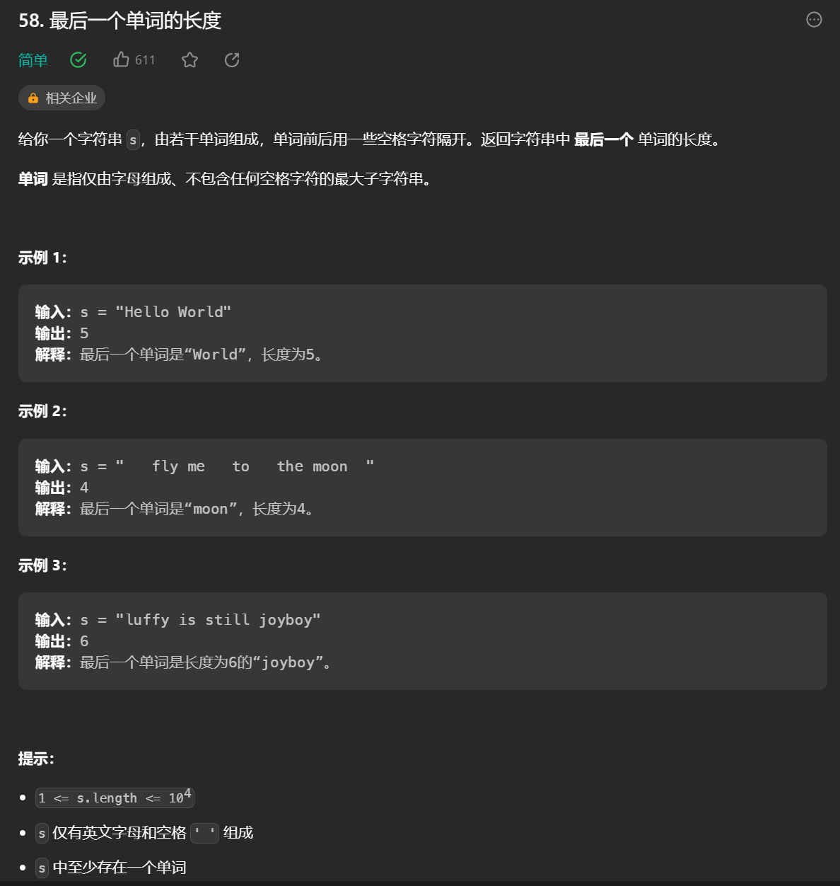

# 0806周报

本周学习了javaweb中SpringbootWeb请求响应，mysql，mybatis的基础知识，了解了三层架构程序执行流程，分层解耦，IOC控制反转和DI依赖注入等内容。



~~~cpp
class Solution {
public:
    int lengthOfLastWord(string s) {

        int head=0,tail=s.length();
        while(s[tail-1]==' '){
            tail--;
        }
        int temp=0;
        while(temp<tail){
            if(s[temp]==' '){
                head=temp+1;
            }
            temp++;
        }

        return max(tail-head,1);

    }
};
~~~


```cp
class Solution {
public:
    vector<vector<int>> generateMatrix(int n) {
        vector<vector<int>> assets(n, vector<int>(n, 0));
        int dx = 0, dy = 1;
        int x = 0, y = 0;
        for (int i = 1; i <= n * n; ++i) {
            assets[x][y] = i;
            if (assets[(x + dx) % n][(y + dy) % n] != 0) {
                int tmp = dy;
                dy = -dx;
                dx = tmp;
            }
            x += dx;
            y += dy;
        }
        return assets;
    }
};
```


#### 1.2.2 SpringBoot方式

在Springboot的环境中，对原始的API进行了封装，接收参数的形式更加简单。 如果是简单参数，参数名与形参变量名相同，定义同名的形参即可接收参数。

~~~java
@RestController
public class RequestController {
    // http://localhost:8080/simpleParam?name=Tom&age=10
    // 第1个请求参数： name=Tom   参数名:name，参数值:Tom
    // 第2个请求参数： age=10     参数名:age , 参数值:10
    
    //springboot方式
    @RequestMapping("/simpleParam")
    public String simpleParam(String name , Integer age ){//形参名和请求参数名保持一致
        System.out.println(name+"  :  "+age);
        return "OK";
    }
}
~~~

> **结论：不论是GET请求还是POST请求，对于简单参数来讲，只要保证==请求参数名和Controller方法中的形参名保持一致==，就可以获取到请求参数中的数据值。**

#### 1.2.3 参数名不一致

如果方法形参名称与请求参数名称不一致，controller方法中的形参还能接收到请求参数值吗？

~~~java
@RestController
public class RequestController {
    // http://localhost:8080/simpleParam?name=Tom&age=20
    // 请求参数名：name

    //springboot方式
    @RequestMapping("/simpleParam")
    public String simpleParam(String username , Integer age ){//请求参数名和形参名不相同
        System.out.println(username+"  :  "+age);
        return "OK";
    }
}
~~~

答案：运行没有报错。 controller方法中的username值为：null，age值为20

- 结论：对于简单参数来讲，请求参数名和controller方法中的形参名不一致时，无法接收到请求数据

那么如果我们开发中，遇到了这种请求参数名和controller方法中的形参名不相同，怎么办？

解决方案：可以使用Spring提供的@RequestParam注解完成映射

在方法形参前面加上 @RequestParam 然后通过value属性执行请求参数名，从而完成映射。代码如下：

```java
@RestController
public class RequestController {
    // http://localhost:8080/simpleParam?name=Tom&age=20
    // 请求参数名：name

    //springboot方式
    @RequestMapping("/simpleParam")
    public String simpleParam(@RequestParam("name") String username , Integer age ){
        System.out.println(username+"  :  "+age);
        return "OK";
    }
}
```

> **注意事项：**
>
> @RequestParam中的required属性默认为true（默认值也是true），代表该请求参数必须传递，如果不传递将报错
>
> 如果该参数是可选的，可以将required属性设置为false
>
> ~~~java
> @RequestMapping("/simpleParam")
> public String simpleParam(@RequestParam(name = "name", required = false) String username, Integer age){
>  System.out.println(username+ ":" + age);
>  return "OK";
> }
> ~~~

### 1.3 实体参数

在使用简单参数做为数据传递方式时，前端传递了多少个请求参数，后端controller方法中的形参就要书写多少个。如果请求参数比较多，通过上述的方式一个参数一个参数的接收，会比较繁琐。 

此时，我们可以考虑将请求参数封装到一个实体类对象中。 要想完成数据封装，需要遵守如下规则：**请求参数名与实体类的属性名相同**

#### 1.3.1 简单实体对象

定义POJO实体类：

```java
public class User {
    private String name;
    private Integer age;

    public String getName() {
        return name;
    }

    public void setName(String name) {
        this.name = name;
    }

    public Integer getAge() {
        return age;
    }

    public void setAge(Integer age) {
        this.age = age;
    }

    @Override
    public String toString() {
        return "User{" +
                "name='" + name + '\'' +
                ", age=" + age +
                '}';
    }
}

```

Controller方法：

```java
@RestController
public class RequestController {
    //实体参数：简单实体对象
    @RequestMapping("/simplePojo")
    public String simplePojo(User user){
        System.out.println(user);
        return "OK";
    }
}
```