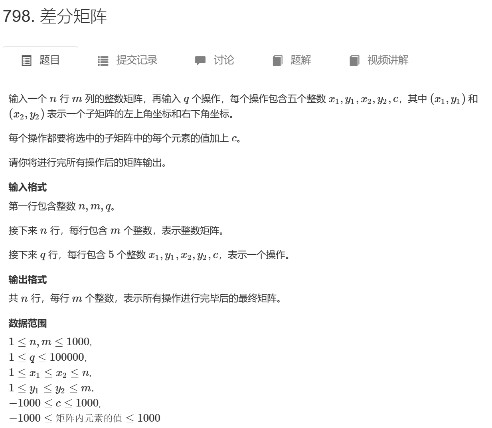

# 0813周报



#### 输入样例：

```
3 4 3
1 2 2 1
3 2 2 1
1 1 1 1
1 1 2 2 1
1 3 2 3 2
3 1 3 4 1
```

#### 输出样例：

```
2 3 4 1
4 3 4 1
2 2 2 2
```

| 难度：**简单**       |
| -------------------- |
| 时/空限制：2s / 64MB |
| 总通过数：74208      |
| 总尝试数：107026     |
| 来源：模板题         |
| 算法标签             |


这里采用了差分数组的方法来更新。

```cpp
#include <iostream>
#include <cstring>
#include <algorithm>
using namespace std;
const int N = 1005;
int a[N][N], b[N][N];
int m, n, q;

// 对差分数组进行更新
void insert(int x1, int y1, int x2, int y2, int c) {
    // 更新差分数组的四个角
    b[x1][y1] += c;
    b[x1][y2 + 1] -= c;
    b[x2 + 1][y1] -= c;
    b[x2 + 1][y2 + 1] += c;
}

int main() {
    scanf("%d%d%d", &n, &m, &q);

    // 读取原始矩阵的值
    for (int i = 1; i <= n; i++) {
        for (int j = 1; j <= m; j++) {
            scanf("%d", &a[i][j]);
        }
    }

    // 构建差分数组
    for (int i = 1; i <= n; i++) {
        for (int j = 1; j <= m; j++) {
            insert(i, j, i, j, a[i][j]);
        }
    }

    // 处理区间更新操作
    while (q--) {
        int x1, x2, y1, y2, c;
        cin >> x1 >> y1 >> x2 >> y2 >> c;
        insert(x1, y1, x2, y2, c);
    }

    // 从差分数组还原得到最终结果
    for (int i = 1; i <= n; i++) {
        for (int j = 1; j <= m; j++) {
            b[i][j] += b[i - 1][j] + b[i][j - 1] - b[i - 1][j - 1];
            printf("%d ", b[i][j]);
        }
        printf("\n");
    }

    return 0;
}
```

这段代码使用差分数组的思想，通过更新差分数组来实现对原始矩阵的区间更新。区别于前一种方法，这里直接对四个角进行加减操作，从而避免了多次累加和累减操作。最后，通过累加差分数组，得到了更新后的矩阵。


#### 输入样例：

```
3 4 3
1 7 2 4
3 6 2 8
2 1 2 3
1 1 2 2
2 1 3 4
1 3 3 4
```

#### 输出样例：

```
17
27
21
```

1. **计算前缀和**：代码接着计算前缀和数组`b`。在位置`b[i][j]`的值表示原始矩阵`a`中从`(1,1)`到`(i,j)`子矩阵的所有元素之和。

   使用以下公式计算前缀和`b[i][j]`：
   ```
   b[i][j] = b[i][j-1] + b[i-1][j] - b[i-1][j-1] + a[i][j]
   ```

2. **区间求和查询**：在计算了前缀和数组后，代码进入循环以处理区间求和查询。每个查询由四个整数定义：`x1`、`y1`、`x2`和`y2`。

   区间求和查询`b[x1][y1]`到`b[x2][y2]`通过以下公式计算：
   ```
   b[x2][y2] - b[x2][y1-1] - b[x1-1][y2] + b[x1-1][y1-1]
   ```


```cpp
#include <iostream>
#include <cstring>
#include <algorithm>
using namespace std;
const int N = 1005;
int m, n, q;
int a[N][N], b[N][N];

int main()
{
    // 读取矩阵的行数、列数和查询次数
    scanf("%d%d%d", &n, &m, &q);

    // 读取原始矩阵的值
    for (int i = 1; i <= n; i++) {
        for (int j = 1; j <= m; j++) {
            scanf("%d", &a[i][j]);
        }
    }

    // 计算前缀和数组
    for (int i = 1; i <= n; i++) {
        for (int j = 1; j <= m; j++) {
            b[i][j] = b[i][j - 1] + b[i - 1][j] - b[i - 1][j - 1] + a[i][j];
        }
    }

    // 处理区间求和查询
    while (q--) {
        int x1, x2, y1, y2;
        cin >> x1 >> y1 >> x2 >> y2;
        
        // 计算并打印区间求和结果
        printf("%d\n", b[x2][y2] - b[x2][y1 - 1] - b[x1 - 1][y2] + b[x1 - 1][y1 - 1]);
    }

    return 0;
}

```

当处理二维区域的前缀和或差分时，以下是两个关键的公式：

1. **前缀和公式**（二维矩阵的前缀和）：
   ```
   b[i][j] = b[i-1][j] + b[i][j-1] - b[i-1][j-1] + a[i][j]
   ```
   其中，`b[i][j]` 是表示从矩阵 `(1,1)` 到 `(i,j)` 子矩阵的元素和，`a[i][j]` 是原始矩阵 `(i,j)` 处的元素值。

2. **差分公式**（用于区域更新）：
   ```
   b[x1][y1] += c
   b[x1][y2+1] -= c
   b[x2+1][y1] -= c
   b[x2+1][y2+1] += c
   ```
   这是用于差分数组的关键公式，其中 `c` 表示在矩阵 `(x1,y1)` 到 `(x2,y2)` 区域内的元素增加了 `c`。

## 本周学习内容

- 了解了SpringBootWeb中如何使用xml映射文件执行动态mysql，限定请求方式，在controller中接受json格式的请求参数
- 了解了如何上传文件，本地or通过阿里云oss
- 了解如何配置yml文件

- 了解了SpringBootWeb开发中登录认证的基本实现方式，以及登录校验的开发，了解了web开发中的会话跟踪技术如Cookie（客户端），Session（服务器），jwt令牌技术，并大概了解了优缺点，统一拦截技术如Servelet规范中的Filter过滤器


## XML映射文件

- XML映射文件的名称与Mapper接口名称一致，并且将XML映射文件和Mapper接口放置在相同包下（同包同名）

- XML映射文件的namespace属性为Mapper接口全限定名一致
- XML映射文件中sql语句的id与Mapper接口中的方法名一致，并保持返回类型一致。

