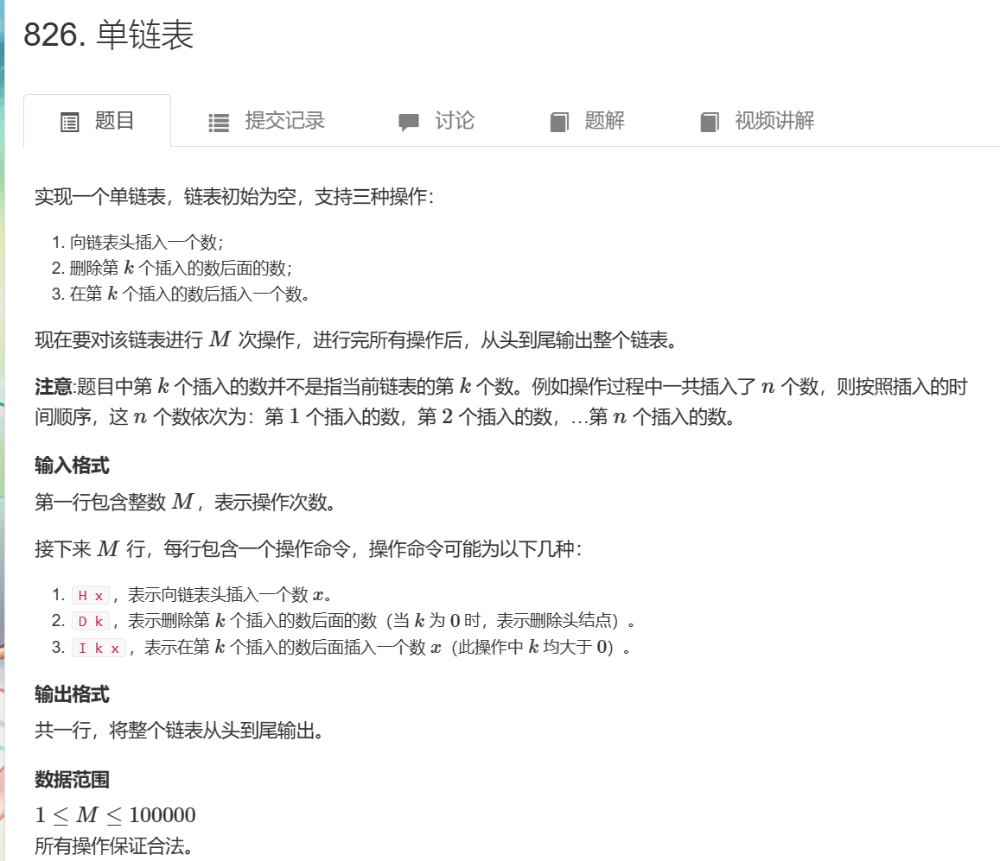
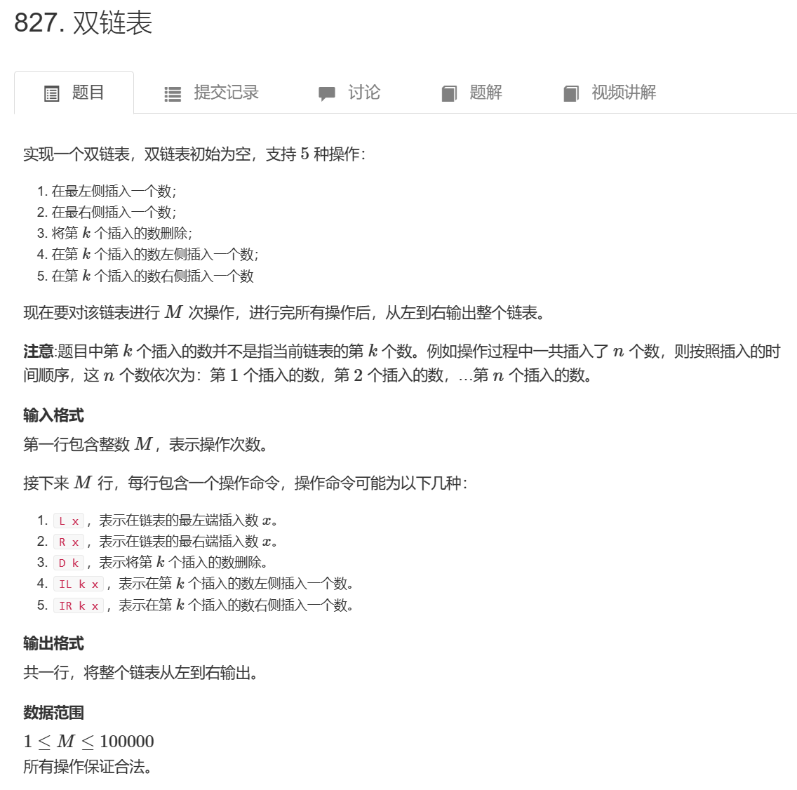

# 0820周报



#### 输入样例：

```
10
H 9
I 1 1
D 1
D 0
H 6
I 3 6
I 4 5
I 4 5
I 3 4
D 6
```

#### 输出样例：

```
6 4 6 5
```

```cpp
#include <iostream>
#include <cstring>
#include <algorithm>
using namespace std;
const int N = 1e6+10;
int e[N],ne[N];
int idx,head;
void insert(int k,int x){
    e[idx]=x;
    ne[idx]=ne[k];
    ne[k]=idx;
    idx++;
}
void del(int k){
    ne[k]=ne[ne[k]];
}
void hea(int x){
    e[idx]=x;
    ne[idx]=head;
    head=idx;
    idx++;
}
void init(){
    idx=0;
    head=-1;
}
int main()
{
    int n;
    scanf("%d", &n);
    init();
    while (n -- ){
        char ch;
        cin>>ch;
        if(ch=='H'){
            int x;
            cin>>x;
            hea(x);
        }
        else if(ch=='I'){
            int k,x;
            cin>>k>>x;
            insert(k-1,x);
        }
        else if(ch=='D'){
            int k;
            cin>>k;
            if(k)
            del(k-1);
            else{
                head=ne[head];
            }
        }
    }
    for(int i=head;i!=-1;i=ne[i]){
        cout<<e[i]<<" ";
    }
    cout<<endl;
}
```



#### 输入样例：

```
10
R 7
D 1
L 3
IL 2 10
D 3
IL 2 7
L 8
R 9
IL 4 7
IR 2 2
```

#### 输出样例：

```
8 7 7 3 2 9
```

| 难度：**简单**       |
| -------------------- |
| 时/空限制：1s / 64MB |
| 总通过数：54359      |
| 总尝试数：78971      |
| 来源：模板题,AcWing  |
| 算法标签             |

```cpp
#include <iostream>
#include <cstring>
#include <algorithm>
using namespace std;
const int N = 1e6+10;
int n,l[N],r[N],idx,e[N];
void ir(int k,int x){
    e[idx]=x;
    r[idx]=r[k];
    l[idx]=k;
    l[r[k]]=idx;
    r[k]=idx;
    idx++;
}
void D(int k){
    r[l[k]]=r[k];
    l[r[k]]=l[k];
}

void init(){
    r[0]=1;
    l[1]=0;
    idx=2;
    
}
int main()
{
    // ios::sync_with_stdio(false);
    // cin.tie(0);
    int n;
    cin>>n;
    init();
    while (n -- ){
        string ch;
        cin>>ch;
        if(ch=="L"){
            int x;
            cin>>x;
            ir(0,x);
        }
        else if(ch=="R"){
            int x;
            cin>>x;
            ir(l[1],x);
        }
        else if(ch=="D"){
            int k;
            cin>>k;
            D(k+1);
        }
        else if(ch=="IL"){
            int k,x;
            cin>>k>>x;
            ir(l[k+1],x);
        }
        else if(ch=="IR"){
            int k,x;
            cin>>k>>x;
            ir(k+1,x);
            
        }
}
    for(int i=r[0];i!=1;i=r[i]){
        printf("%d ",e[i]);
    }

    }
```

这周比较忙，学的不多

- 了解了虚拟机的基本安装流程
- 学习了计算机网络的链路层基础部分
- 观看了瑞吉外卖的day01部分

